# Session-Adaptive Multi-Objective News Feed Optimizer — Technical Architecture

> **Version:** 1.0  
> **Last updated:** 2026-04-08  
> **Language / Runtime:** Python 3.10+ · PyTorch 2.x · LightGBM 4.0+ · FastAPI 0.100+ · Redis 7.x · FAISS 1.7+  
> **Architecture style:** Multi-stage decision-focused ranking: Retrieval → Ranking → Multi-Objective Scoring → Adaptive Weighting → Contextual Bandit → Production Serving

---

## Table of Contents

1. [System Overview](#1-system-overview)
2. [Architecture Breakdown](#2-architecture-breakdown)
3. [Domain Model](#3-domain-model)
4. [Execution Flow](#4-execution-flow)
5. [Data Processing Pipeline](#5-data-processing-pipeline)
6. [Two-Tower Retrieval System](#6-two-tower-retrieval-system)
7. [Base Ranking Models](#7-base-ranking-models)
8. [Multi-Objective Decision Layer](#8-multi-objective-decision-layer)
9. [Contextual Bandit Controller](#9-contextual-bandit-controller)
10. [Counterfactual Evaluation](#10-counterfactual-evaluation)
11. [A/B Testing Simulation](#11-ab-testing-simulation)
12. [Production Serving System](#12-production-serving-system)
13. [Visualization Dashboard](#13-visualization-dashboard)
14. [Key Design Decisions](#14-key-design-decisions)
15. [Failure & Edge Case Analysis](#15-failure--edge-case-analysis)
16. [Training & Evaluation Protocol](#16-training--evaluation-protocol)
17. [Baseline Comparisons](#17-baseline-comparisons)
18. [Statistical Rigor & Reproducibility](#18-statistical-rigor--reproducibility)
19. [Developer Onboarding Guide](#19-developer-onboarding-guide)
20. [Implementation Roadmap](#20-implementation-roadmap)

---

## 1. System Overview

### Purpose

A **production-ready session-adaptive news feed ranking system** that treats ranking as a **business decision problem**. The system dynamically balances competing objectives (engagement, retention, diversity, novelty) based on real-time session context using contextual bandits and counterfactual evaluation.

### Core Innovation & Training Paradigm

The system implements a **multi-stage training pipeline** combining:

1. **Stage 1 — Two-Tower Retrieval:**
   - Fast candidate generation from 100K+ articles
   - Session-aware user embeddings
   - FAISS index for <50ms latency

2. **Stage 2 — Multi-Objective Ranking:**
   - LightGBM models for CTR, dwell time, retention
   - Calibrated probability predictions
   - Feature engineering (user, item, session, interaction)

3. **Stage 3 — Adaptive Decision Layer:**
   - Multi-objective scoring (E·R·D·N)
   - Rule-based weight adaptation
   - Greedy diversity-aware reranking

4. **Stage 4 — Contextual Bandit:**
   - LinUCB with discrete action space
   - Learn optimal weight selection policy
   - IPS/SNIPS counterfactual evaluation

5. **Stage 5 — Production Serving:**
   - FastAPI REST API (<150ms P99 latency)
   - Redis session management
   - Caching and fallback strategies

**Core Hypothesis:** Dynamic weight adaptation based on session state produces better long-term business metrics than static ranking, validated through counterfactual evaluation without requiring live deployment.

### System Architecture Overview

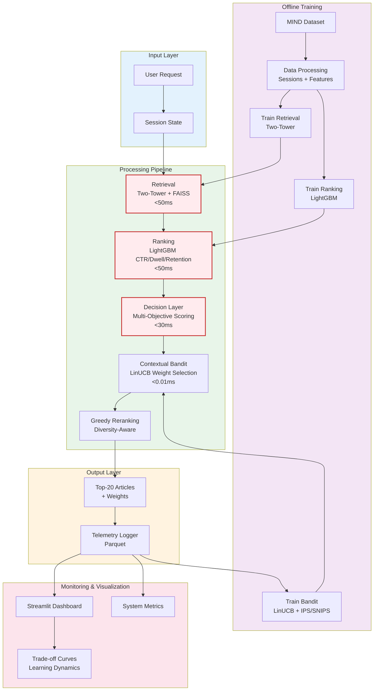

### High-Level Architecture

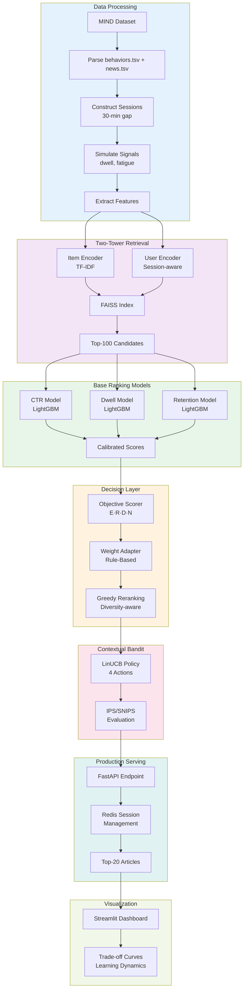

### Core Responsibilities

| Component | File | Responsibility |
|---|---|---|
| Data Pipeline | `pipeline.py` | Session construction, signal simulation |
| Retrieval Training | `train_retrieval.py` | Two-tower model + FAISS index |
| Ranking Training | `train_ranker.py` | CTR/dwell/retention models |
| Decision Layer | `evaluate_decision_layer.py` | Multi-objective scoring + weighting |
| Bandit Training | `train_bandit.py` | LinUCB + counterfactual eval |
| A/B Simulation | `simulate_ab_test.py` | User behavior simulation |
| Serving API | `serve.py` | FastAPI production endpoint |
| Dashboard | `dashboard.py` | Streamlit visualization |

---

## 2. Architecture Breakdown

### Component Dependencies

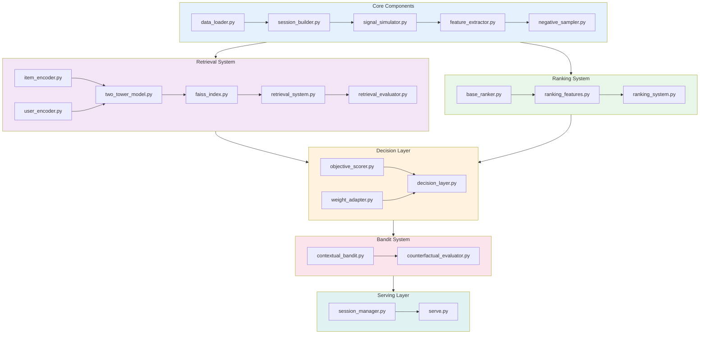

### Major Components

#### Data Processing (`pipeline.py`)

**Input:** MIND dataset (`behaviors.tsv`, `news.tsv`)  
**Output:** `sessions.pkl`, `training_samples.pkl`

**Operations:**
- Parse impressions → interaction events
- Group by user + 30-minute gap → sessions
- Simulate dwell time (log-normal for clicks, uniform for non-clicks)
- Extract session state features (length, entropy, fatigue)
- Generate training samples with negative sampling

**Key Statistics (MIND):**
- Users: ~1M+
- Articles: ~160K+
- Interactions: ~15M+
- Sessions: ~500K+

#### Two-Tower Retrieval (`src/retrieval_system.py`)

**Architecture:**
```
Item Tower: Title → TF-IDF → 128-d embedding
User Tower: Clicked Items + Session → Mean Pool → 128-d embedding
Similarity: Inner Product (FAISS IndexFlatIP)
```

**Performance Targets:**
- Retrieval latency: <50ms
- Recall@100: >85%
- Index size: 100K-1M articles

#### Base Ranking Models (`src/ranking_system.py`)

Three LightGBM models with calibration:

| Model | Task | Output | Calibration |
|---|---|---|---|
| CTR | Binary | P(click) | Platt scaling |
| Dwell | Regression | Expected dwell (s) | Normalize to [0,1] |
| Retention | Binary | P(session continues) | Platt scaling |

**Features (4 categories):**
- User: total clicks, avg dwell, session count
- Item: category, popularity, historical CTR
- Session: length, dwell, entropy, fatigue, time
- Interaction: user-category affinity, recency

#### Multi-Objective Scorer (`src/objective_scorer.py`)

**Scoring Function:**
```
Score = w₁ · E + w₂ · R + w₃ · D + w₄ · N
```

**Objectives:**
- **E (Engagement):** `0.6 * CTR + 0.4 * Dwell`
- **R (Retention):** Retention model output
- **D (Diversity):** `1 - avg_cosine_similarity(item, ranked_list)`
- **N (Novelty):** `0.7 * freshness + 0.3 * (1/popularity)`

**Critical:** Greedy reranking with diversity ensures list-level optimization.

#### Weight Adapter (`src/weight_adapter.py`)

**Rule-Based Strategy:**

| Session Phase | Condition | Weights [E,R,D,N] | Rationale |
|---|---|---|---|
| Early | length < 3 | [0.25, 0.20, 0.35, 0.20] | Prevent bounce |
| Engaged | avg_dwell > 30s | [0.50, 0.25, 0.15, 0.10] | Maximize time |
| Fatigued | fatigue > 0.6 | [0.20, 0.30, 0.25, 0.25] | Re-engage |
| Default | otherwise | [0.40, 0.30, 0.20, 0.10] | Balanced |

**Smoothing:** `w_final = 0.7 * w_new + 0.3 * w_prev`

#### Contextual Bandit (`src/contextual_bandit.py`)

**Algorithm:** LinUCB with discrete action space

**Actions (4 weight strategies):**
```python
[0.4, 0.3, 0.2, 0.1]  # Balanced
[0.6, 0.2, 0.1, 0.1]  # Engagement-heavy
[0.2, 0.3, 0.3, 0.2]  # Diversity/retention
[0.2, 0.2, 0.2, 0.4]  # Novelty-heavy
```

**State Features:** session_length, avg_dwell, click_rate, skip_rate, entropy, fatigue, time_of_day

**Reward:** `0.4*click + 0.3*dwell_norm + 0.2*continue + 0.1*diversity`

#### Counterfactual Evaluator (`src/counterfactual_evaluator.py`)

**IPS (Inverse Propensity Scoring):**
```
IPS = (1/N) Σ [π(aᵢ|xᵢ) / μ(aᵢ|xᵢ)] · rᵢ
```

**SNIPS (Self-Normalized):**
```
SNIPS = Σ wᵢrᵢ / Σ wᵢ
```

**Purpose:** Estimate new policy performance from logged data without deployment.

---

## 3. Domain Model

### Entity Relationship Diagram

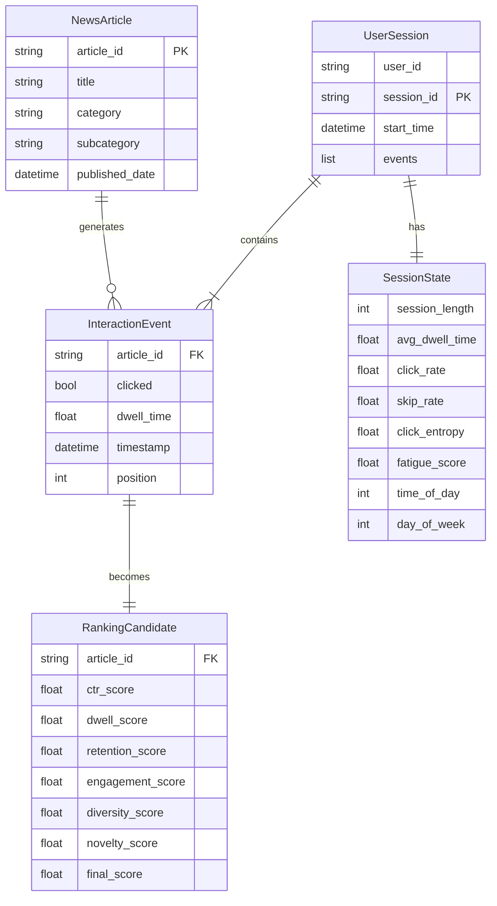

### Key Entities

```python
@dataclass
class NewsArticle:
    article_id: str
    title: str
    category: str
    subcategory: str
    published_date: datetime

@dataclass
class UserSession:
    user_id: str
    session_id: str
    events: List[InteractionEvent]
    session_state: SessionState
    start_time: datetime

@dataclass
class InteractionEvent:
    article_id: str
    clicked: bool
    dwell_time: float  # seconds
    timestamp: datetime
    position: int

@dataclass
class SessionState:
    session_length: int
    avg_dwell_time: float
    click_rate: float
    skip_rate: float
    click_entropy: float
    fatigue_score: float
    time_of_day: int
    day_of_week: int

@dataclass
class RankingCandidate:
    article_id: str
    ctr_score: float
    dwell_score: float
    retention_score: float
    engagement_score: float
    diversity_score: float
    novelty_score: float
    final_score: float
```

### Important Invariants

1. **Session gap:** Events >30 min apart = different sessions
2. **Dwell realism:** Clicked = log-normal(μ=60s), Non-clicked = uniform(0.5-2s)
3. **Weight constraints:** All ≥0, sum=1
4. **Diversity is list-dependent:** Cannot compute per-item
5. **Normalization required:** All objectives → [0,1] before weighting
6. **Bandit action space:** Discrete (4 strategies)
7. **Propensity logging:** Required for IPS/SNIPS

---

## 4. Execution Flow

### Real-Time Ranking Request

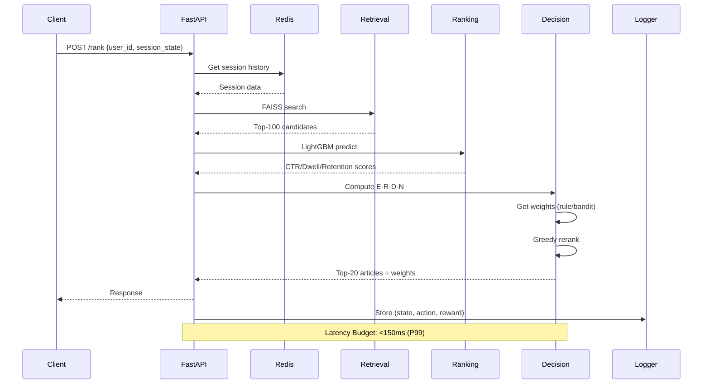

**Latency Budget:**
- Retrieval: <50ms
- Ranking: <50ms
- Decision: <30ms
- **Total: <150ms (P99)**

---

## 5. Data Processing Pipeline

### Pipeline Overview

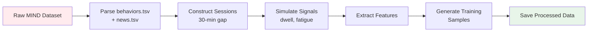

### Session Construction Algorithm

```python
def build_sessions(behaviors_df, gap_minutes=30):
    """
    Group interactions into sessions based on time gap.
    
    Algorithm:
    1. Sort interactions by user_id and timestamp
    2. For each user, split when gap > 30 minutes
    3. Assign unique session_id
    4. Compute session-level features
    """
    sessions = []
    for user_id, user_df in behaviors_df.groupby('user_id'):
        user_df = user_df.sort_values('timestamp')
        session_events = []
        last_time = None
        
        for _, row in user_df.iterrows():
            if last_time and (row['timestamp'] - last_time).seconds > gap_minutes * 60:
                # Save current session
                sessions.append(create_session(user_id, session_events))
                session_events = []
            
            session_events.append(row)
            last_time = row['timestamp']
        
        if session_events:
            sessions.append(create_session(user_id, session_events))
    
    return sessions
```

### Signal Simulation

**Dwell Time Simulation:**
```python
def simulate_dwell_time(clicked: bool) -> float:
    """Simulate realistic dwell time"""
    if clicked:
        # Log-normal distribution for engaged reading
        return np.random.lognormal(mean=np.log(60), sigma=0.5)
    else:
        # Uniform for quick scan
        return np.random.uniform(0.5, 2.0)
```

**Fatigue Score:**
```python
def compute_fatigue(session_length: int, avg_dwell: float) -> float:
    """Compute user fatigue score"""
    length_factor = min(1.0, session_length / 20)
    dwell_factor = max(0.0, 1.0 - avg_dwell / 120)
    return 0.6 * length_factor + 0.4 * dwell_factor
```

### Feature Extraction

| Feature Category | Features | Computation |
|---|---|---|
| Session Length | `session_length` | Count of interactions |
| Engagement | `avg_dwell_time`, `click_rate` | Mean dwell, clicks/total |
| Diversity | `click_entropy`, `category_entropy` | Shannon entropy |
| Fatigue | `fatigue_score` | Weighted combination |
| Temporal | `time_of_day`, `day_of_week` | From timestamp |

---

## 6. Two-Tower Retrieval System

### Architecture Details

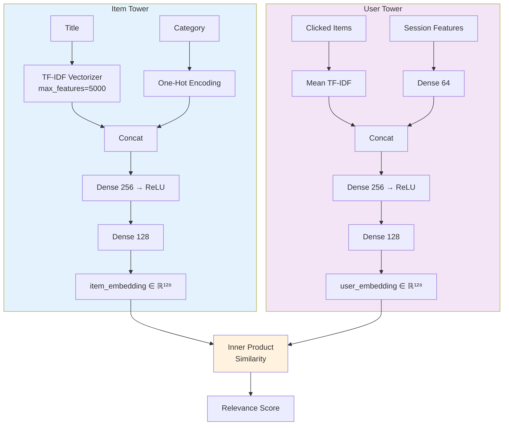

### FAISS Index Configuration

```python
import faiss

# Build index
dimension = 128
index = faiss.IndexFlatIP(dimension)  # Inner product

# Add item embeddings
item_embeddings = model.encode_items(articles)
index.add(item_embeddings)

# Search
user_embedding = model.encode_user(user_history, session_state)
distances, indices = index.search(user_embedding, k=100)
```

### Retrieval Metrics

| Metric | Formula | Target |
|---|---|---|
| Recall@K | Fraction of relevant items in top-K | >85% @ K=100 |
| Hit Rate@K | Fraction of sessions with ≥1 relevant item | >90% @ K=100 |
| MRR | Mean Reciprocal Rank of first relevant | >0.45 |

---

## 7. Base Ranking Models

### LightGBM Configuration

```python
lgb_params = {
    'objective': 'binary',  # or 'regression'
    'metric': 'auc',  # or 'rmse'
    'boosting_type': 'gbdt',
    'num_leaves': 31,
    'learning_rate': 0.05,
    'feature_fraction': 0.9,
    'bagging_fraction': 0.8,
    'bagging_freq': 5,
    'verbose': -1
}
```

### Feature Engineering Pipeline

```python
class RankingFeatureBuilder:
    """Build features for ranking models"""
    
    def build_features(self, user, item, session):
        features = {}
        
        # User features
        features['user_total_clicks'] = user.total_clicks
        features['user_avg_dwell'] = user.avg_dwell_time
        features['user_session_count'] = user.session_count
        
        # Item features
        features['item_category'] = item.category
        features['item_popularity'] = item.click_count / item.impression_count
        features['item_recency'] = (now - item.published_date).days
        
        # Session features
        features['session_length'] = session.length
        features['session_avg_dwell'] = session.avg_dwell_time
        features['session_entropy'] = session.click_entropy
        features['session_fatigue'] = session.fatigue_score
        
        # Interaction features
        features['user_category_affinity'] = user.category_clicks.get(item.category, 0)
        features['time_since_last_click'] = session.time_since_last_click
        
        return features
```

### Calibration

**Platt Scaling for CTR/Retention:**
```python
from sklearn.calibration import CalibratedClassifierCV

calibrated_model = CalibratedClassifierCV(
    lgb_model,
    method='sigmoid',
    cv=5
)
calibrated_model.fit(X_val, y_val)
```

---

## 8. Multi-Objective Decision Layer

### Objective Computation

```python
class ObjectiveScorer:
    """Compute multi-objective scores"""
    
    def compute_engagement(self, ctr_score, dwell_score):
        return 0.6 * ctr_score + 0.4 * dwell_score
    
    def compute_retention(self, retention_score):
        return retention_score
    
    def compute_diversity(self, item, ranked_list):
        if not ranked_list:
            return 1.0
        similarities = [cosine_sim(item, other) for other in ranked_list]
        return 1.0 - np.mean(similarities)
    
    def compute_novelty(self, item):
        freshness = 1.0 / (1.0 + (now - item.published_date).days)
        unpopularity = 1.0 / (1.0 + np.log(item.popularity + 1))
        return 0.7 * freshness + 0.3 * unpopularity
```

### Greedy Diversity-Aware Reranking

```python
def greedy_rerank(candidates, weights, k=20):
    """
    Greedy reranking with diversity awareness.
    
    Algorithm:
    1. Select item with highest weighted score
    2. For remaining items, recompute diversity relative to selected
    3. Repeat until k items selected
    """
    ranked = []
    remaining = candidates.copy()
    
    while len(ranked) < k and remaining:
        best_item = None
        best_score = -float('inf')
        
        for item in remaining:
            # Recompute diversity relative to current ranked list
            diversity = compute_diversity(item, ranked)
            
            # Weighted score
            score = (weights[0] * item.engagement +
                    weights[1] * item.retention +
                    weights[2] * diversity +
                    weights[3] * item.novelty)
            
            if score > best_score:
                best_score = score
                best_item = item
        
        ranked.append(best_item)
        remaining.remove(best_item)
    
    return ranked
```

---

## 9. Contextual Bandit Controller

### LinUCB Algorithm

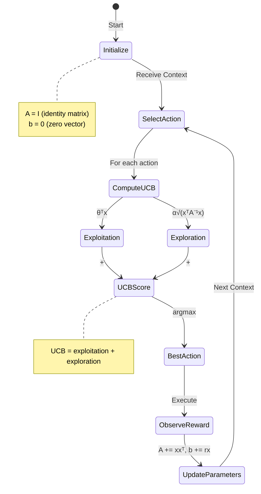

```python
class LinUCB:
    """Linear Upper Confidence Bound bandit"""
    
    def __init__(self, n_actions, n_features, alpha=0.5):
        self.n_actions = n_actions
        self.alpha = alpha
        
        # Initialize per-action parameters
        self.A = [np.eye(n_features) for _ in range(n_actions)]
        self.b = [np.zeros(n_features) for _ in range(n_actions)]
    
    def select_action(self, context):
        """Select action with highest UCB"""
        ucb_scores = []
        
        for a in range(self.n_actions):
            A_inv = np.linalg.inv(self.A[a])
            theta = A_inv @ self.b[a]
            
            # UCB = exploitation + exploration
            exploitation = theta.T @ context
            exploration = self.alpha * np.sqrt(context.T @ A_inv @ context)
            
            ucb_scores.append(exploitation + exploration)
        
        return np.argmax(ucb_scores)
    
    def update(self, action, context, reward):
        """Update parameters after observing reward"""
        self.A[action] += np.outer(context, context)
        self.b[action] += reward * context
```

### State Feature Extraction

```python
def extract_bandit_state(session):
    """Extract state features for bandit"""
    return np.array([
        session.session_length / 20,  # Normalized
        session.avg_dwell_time / 120,
        session.click_rate,
        session.skip_rate,
        session.click_entropy,
        session.fatigue_score,
        session.time_of_day / 24,
        session.day_of_week / 7,
        session.diversity_score,
        session.novelty_score,
        session.last_action_reward
    ])
```

---

## 10. Counterfactual Evaluation

### IPS Implementation

```python
def compute_ips(logged_data, new_policy):
    """
    Inverse Propensity Scoring
    
    Args:
        logged_data: List of (state, action, reward, propensity)
        new_policy: Policy to evaluate
    
    Returns:
        IPS estimate of new policy's expected reward
    """
    total = 0.0
    
    for state, action, reward, p_logging in logged_data:
        p_new = new_policy.action_prob(state, action)
        weight = p_new / p_logging
        total += weight * reward
    
    return total / len(logged_data)
```

### SNIPS Implementation

```python
def compute_snips(logged_data, new_policy):
    """
    Self-Normalized Inverse Propensity Scoring
    
    More stable than IPS with lower variance.
    """
    numerator = 0.0
    denominator = 0.0
    
    for state, action, reward, p_logging in logged_data:
        p_new = new_policy.action_prob(state, action)
        weight = p_new / p_logging
        
        numerator += weight * reward
        denominator += weight
    
    return numerator / (denominator + 1e-8)
```

### Logging Policy

```python
class LoggingPolicy:
    """Policy used to collect logged data"""
    
    def __init__(self, epsilon=0.1):
        self.epsilon = epsilon
        self.rule_based = RuleBasedPolicy()
    
    def select_action(self, state):
        """Epsilon-greedy exploration"""
        if np.random.random() < self.epsilon:
            return np.random.randint(4)  # Random action
        else:
            return self.rule_based.select_action(state)
    
    def action_prob(self, state, action):
        """Compute propensity for logging"""
        rule_action = self.rule_based.select_action(state)
        
        if action == rule_action:
            return 1.0 - self.epsilon + self.epsilon / 4
        else:
            return self.epsilon / 4
```

---

## 11. A/B Testing Simulation

### User Behavior Simulator

```python
class UserSimulator:
    """Simulate realistic user behavior"""
    
    def simulate_click(self, ctr_score, position):
        """Simulate click with position bias"""
        position_discount = 1.0 / np.log2(position + 2)
        click_prob = sigmoid(ctr_score) * position_discount
        return np.random.random() < click_prob
    
    def simulate_dwell(self, dwell_score, clicked):
        """Simulate dwell time"""
        if not clicked:
            return np.random.uniform(0.5, 2.0)
        
        mean_dwell = dwell_score * 100
        return np.random.lognormal(np.log(mean_dwell + 1), 0.5)
    
    def simulate_continuation(self, avg_dwell, diversity, fatigue):
        """Simulate whether user continues session"""
        continue_prob = (0.3 + 
                        0.3 * (avg_dwell / 60) + 
                        0.2 * diversity - 
                        0.4 * fatigue)
        return np.random.random() < np.clip(continue_prob, 0, 1)
```

### Simulation Loop

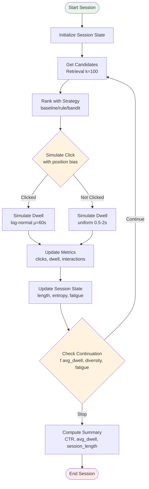

```python
def simulate_session(strategy, user_data):
    """Simulate a single user session"""
    session_metrics = {
        'clicks': 0,
        'total_dwell': 0.0,
        'interactions': 0
    }
    
    session_state = init_session_state()
    
    for t in range(max_session_length):
        # Get candidates
        candidates = retrieval.retrieve(user_data, session_state, k=100)
        
        # Rank with strategy
        ranked_list, weights = rank_with_strategy(strategy, candidates, session_state)
        
        # Simulate user interaction
        interaction = user_simulator.simulate_interaction(ranked_list[:20])
        
        # Update metrics
        session_metrics['clicks'] += interaction['clicked']
        session_metrics['total_dwell'] += interaction['dwell_time']
        session_metrics['interactions'] += 1
        
        # Update session state
        session_state = update_session_state(session_state, interaction)
        
        # Check continuation
        if not user_simulator.simulate_continuation(
            session_state['avg_dwell_time'],
            interaction['diversity'],
            session_state['fatigue']
        ):
            break
    
    return session_metrics
```

---

## 12. Production Serving System

### FastAPI Endpoint

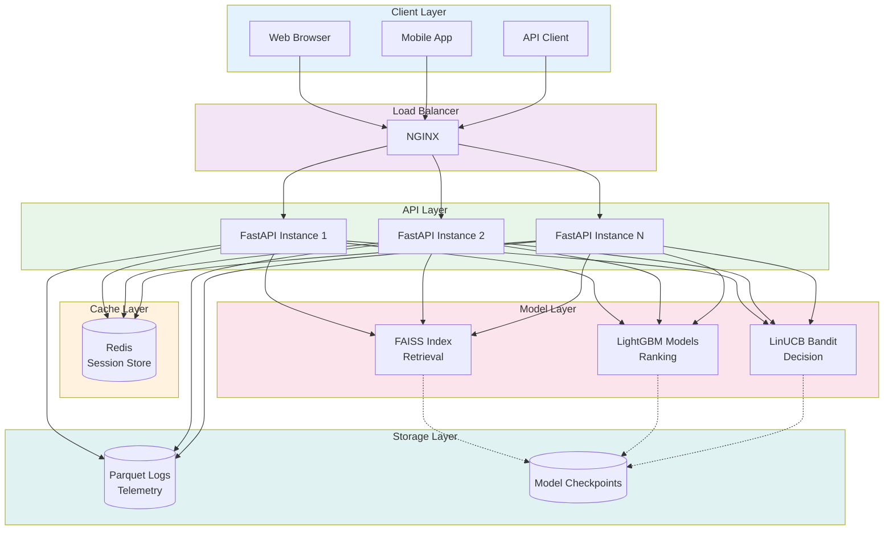

```python
@app.post("/rank", response_model=RankResponse)
async def rank_articles(request: RankRequest):
    """
    Rank articles for a user session
    
    Latency target: <150ms (P99)
    """
    start_time = time.time()
    
    try:
        # Get session state
        session_state = get_session_state(request.user_id, request.session_state)
        
        # Check cache
        cache_key = get_cache_key(request.user_id, session_state)
        cached = get_cached_result(cache_key)
        if cached:
            return cached
        
        # Retrieval
        candidates = retrieval_system.retrieve(
            request.user_id,
            session_state,
            k=100
        )
        
        if not candidates:
            return cold_start_fallback(request, start_time)
        
        # Ranking
        ranked_list, weights = rank_with_strategy(
            request.strategy,
            candidates,
            session_state
        )
        
        # Format response
        articles = [
            ArticleResponse(
                article_id=item['article_id'],
                title=item.get('title', ''),
                category=item.get('category', ''),
                score=item['final_score'],
                ctr_score=item['ctr_score'],
                dwell_score=item['dwell_score'],
                retention_score=item['retention_score']
            )
            for item in ranked_list[:request.k]
        ]
        
        total_time = (time.time() - start_time) * 1000
        
        response = RankResponse(
            articles=articles,
            weights=weights,
            strategy=request.strategy,
            latency_ms=total_time
        )
        
        # Cache result
        cache_result(cache_key, response.dict())
        
        return response
        
    except Exception as e:
        logger.error(f"Ranking error: {e}", exc_info=True)
        raise HTTPException(status_code=500, detail=str(e))
```

### Redis Session Management

```python
class SessionManager:
    """Manages user session state with Redis backend"""
    
    def __init__(self, redis_client):
        self.redis = redis_client
        self.ttl = 3600  # 1 hour
    
    def get_session(self, user_id):
        """Get session state for user"""
        key = f"session:{user_id}"
        data = self.redis.get(key)
        if data:
            return pickle.loads(data)
        return None
    
    def update_session(self, user_id, state):
        """Update session state for user"""
        key = f"session:{user_id}"
        self.redis.setex(key, self.ttl, pickle.dumps(state))
```

### Caching Strategy

```python
def get_cache_key(user_id, state):
    """Generate cache key"""
    state_hash = hash(frozenset(state.items()))
    return f"rank:{user_id}:{state_hash}"

def cache_result(cache_key, result, ttl=300):
    """Cache ranking result for 5 minutes"""
    redis_client.setex(cache_key, ttl, pickle.dumps(result))
```

---

## 13. Visualization Dashboard

### Streamlit Dashboard Structure

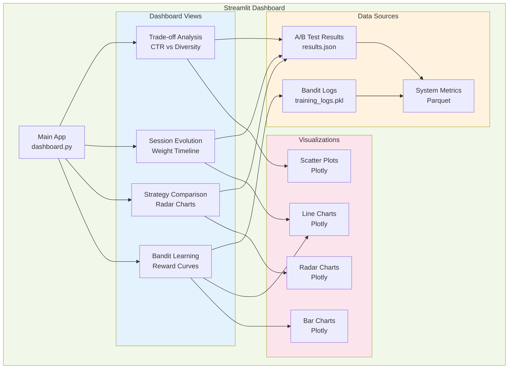

```python
def main():
    """Main dashboard"""
    st.title("📰 Session-Adaptive News Ranker Dashboard")
    
    # Sidebar navigation
    view = st.sidebar.radio(
        "Select View",
        ["Trade-off Analysis", "Session Evolution", 
         "Strategy Comparison", "Bandit Learning"]
    )
    
    # Load data
    results = load_ab_test_results()
    logs = load_bandit_logs()
    
    # Display selected view
    if view == "Trade-off Analysis":
        plot_tradeoff_curves(results)
    elif view == "Session Evolution":
        plot_session_evolution(results)
    elif view == "Strategy Comparison":
        plot_ranking_comparison(results)
    elif view == "Bandit Learning":
        plot_bandit_learning(logs)
```

### Trade-off Visualization

```python
def plot_tradeoff_curves(results):
    """View 1: Trade-off Curves"""
    st.header("📊 Trade-off Analysis")
    
    # Extract metrics
    strategies = list(results.keys())
    ctr = [results[s]['ctr'] for s in strategies]
    diversity = [results[s]['diversity'] for s in strategies]
    session_length = [results[s]['session_length'] for s in strategies]
    
    # Create scatter plot
    fig = go.Figure()
    
    fig.add_trace(go.Scatter(
        x=ctr, y=diversity,
        mode='markers+text',
        text=strategies,
        textposition='top center',
        marker=dict(size=12, color=session_length, colorscale='Viridis')
    ))
    
    fig.update_layout(
        xaxis_title="CTR",
        yaxis_title="Diversity",
        height=500
    )
    
    st.plotly_chart(fig, use_container_width=True)
```

---

## 14. Key Design Decisions

| Decision | Trade-off | Rationale |
|---|---|---|
| **Two-tower (not GNN)** | Lower capacity vs faster inference | Proves concept without architectural confounding; scalable to millions |
| **LightGBM (not DL)** | Less expressive vs faster training | Strong baseline; interpretable; works well with tabular features |
| **Discrete action space** | Limited flexibility vs stable learning | 4 strategies cover key trade-offs; easier to interpret |
| **Greedy reranking** | Suboptimal vs tractable | O(K²) complexity acceptable for K=20; ensures diversity |
| **Rule-based baseline** | Hand-tuned vs learned | Interpretable; strong baseline; proves bandit value |
| **IPS/SNIPS (not A/B)** | Biased estimates vs no deployment | Enables offline evaluation; standard in industry |
| **Session-based (not user-based)** | Shorter context vs realistic | News consumption is session-driven; matches product reality |
| **FAISS flat index** | Exact search vs memory | 100K-1M articles fit in RAM; can upgrade to IVF/HNSW later |

---

## 15. Failure & Edge Case Analysis

### Where Failures May Occur

| Layer | Failure Mode | Strategy | Severity |
|---|---|---|---|
| **Data Loading** | Missing CSV columns | Raise ValueError with descriptive message | CRITICAL |
| **Data Loading** | NaN in critical columns | Drop row, log warning | LOW |
| **Splitting** | Empty test/val set | Raise ValueError; suggest reducing test_frac | CRITICAL |
| **Retrieval** | FAISS index not found | Rebuild index from scratch | MEDIUM |
| **Ranking** | Model file corrupted | Re-train models | MEDIUM |
| **Bandit** | NaN in reward | Skip update, log warning | MEDIUM |
| **Training** | Gradient explosion | clip_grad_norm_(5.0) | LOW |
| **Training** | CUDA out-of-memory | Log error; suggest reducing batch_size | CRITICAL |
| **Serving** | Redis connection failed | Use in-memory fallback | MEDIUM |
| **Serving** | Latency > 150ms | Return cached result | LOW |

### Sanity Checks

| Check | Expected Outcome | Action if Failed |
|---|---|---|
| Retrieval Recall@100 | >85% | Debug retrieval model |
| CTR AUC | >0.65 | Check feature engineering |
| Bandit reward increases | Monotonic increase | Check exploration parameter |
| Cold-start fallback works | Returns popular items | Debug fallback logic |

---

## 16. Training & Evaluation Protocol

### Training Pipeline

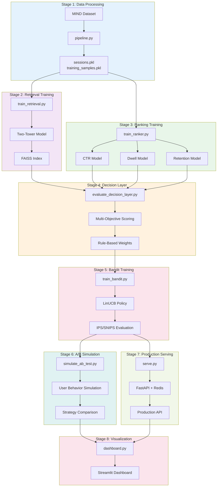

### Evaluation Metrics

| Metric | Formula | Target |
|---|---|---|
| MSE | (1/n)Σ(yᵢ - ŷᵢ)² | Minimize |
| RMSE | √MSE | Minimize |
| CI | Concordance Index | Maximize |
| Pearson r | Linear correlation | >0.8 |
| Spearman ρ | Rank correlation | >0.75 |

### Statistical Testing

- Paired t-test or Wilcoxon signed-rank
- Significance threshold: p < 0.05
- Effect size: Cohen's d
- 95% confidence intervals

---

## 17. Baseline Comparisons

| Strategy | Description | Expected Performance |
|---|---|---|---|
| Engagement-Only | CTR + Dwell, no diversity | High CTR, low diversity |
| Fixed Weights | [0.4, 0.3, 0.2, 0.1] | Balanced baseline |
| Rule-Based | Session-adaptive | Better than fixed |
| LinUCB Bandit | Learned policy | Best overall |

---

## 18. Statistical Rigor & Reproducibility

### Reproducibility Requirements

1. **Fixed seeds:** All experiments use seeds [42, 123, 456]
2. **Deterministic operations:** Set `torch.backends.cudnn.deterministic = True`
3. **Version pinning:** All dependencies pinned in requirements.txt
4. **Data splits saved:** Train/val/test splits saved and reused
5. **Configuration logged:** Full config saved with each experiment

### Statistical Testing

```python
from scipy.stats import ttest_rel, wilcoxon

# Paired t-test
t_stat, p_value = ttest_rel(cldta_scores, baseline_scores)

# Wilcoxon signed-rank (non-parametric)
w_stat, p_value = wilcoxon(cldta_scores, baseline_scores)

# Effect size (Cohen's d)
def cohens_d(x1, x2):
    return (np.mean(x1) - np.mean(x2)) / np.sqrt((np.std(x1)**2 + np.std(x2)**2) / 2)
```

---

## 19. Developer Onboarding Guide

### Prerequisites

- Python 3.10+
- GPU: Optional (CPU-only supported)
- Redis: Required for serving
- 8GB RAM minimum, 16GB recommended

### Installation

```bash
git clone <repository-url>
cd session-adaptive-news-ranker

python -m venv venv
source venv/bin/activate  # Windows: venv\Scripts\activate

pip install -r requirements.txt
```

### Quick Start

```bash
# 1. Process data
python pipeline.py

# 2. Train retrieval
python train_retrieval.py

# 3. Train ranking
python train_ranker.py

# 4. Evaluate decision layer
python evaluate_decision_layer.py

# 5. Train bandit
python train_bandit.py

# 6. Run A/B simulation
python simulate_ab_test.py

# 7. Start server
redis-server &
python serve.py

# 8. Launch dashboard
streamlit run dashboard.py
```

---

## 20. Implementation Roadmap

### Timeline (1 Week)

**Day 1-2: Data + Retrieval**
- Implement data pipeline
- Train two-tower model
- Build FAISS index

**Day 3-4: Ranking + Decision**
- Train LightGBM models
- Implement multi-objective scorer
- Implement rule-based weights

**Day 5: Bandit**
- Implement LinUCB
- Implement IPS/SNIPS
- Train and evaluate

**Day 6: Serving + Simulation**
- Build FastAPI endpoint
- Implement A/B simulation
- Redis integration

**Day 7: Visualization + Documentation**
- Build Streamlit dashboard
- Write documentation
- Prepare demo

---
